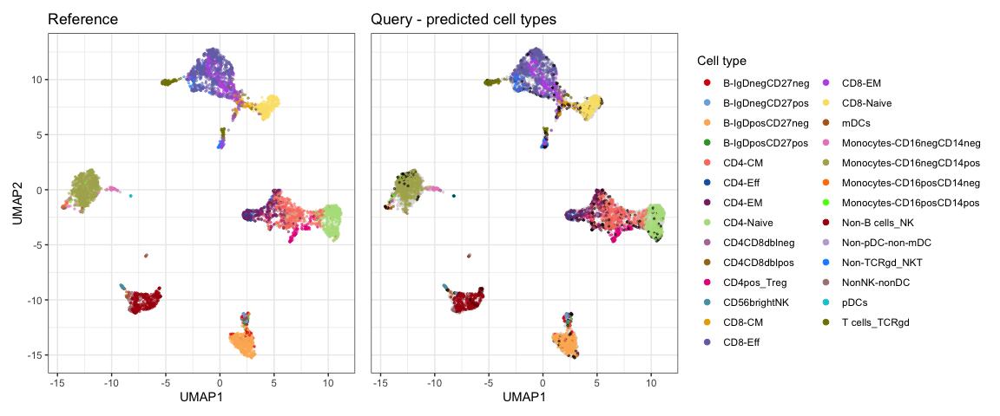
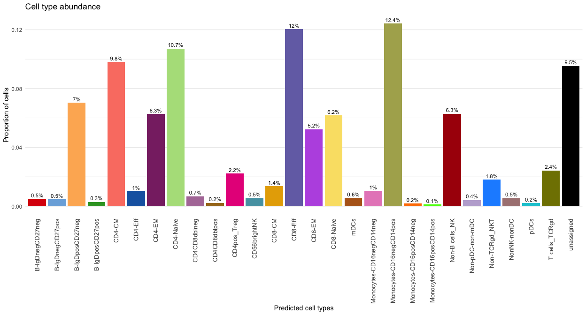
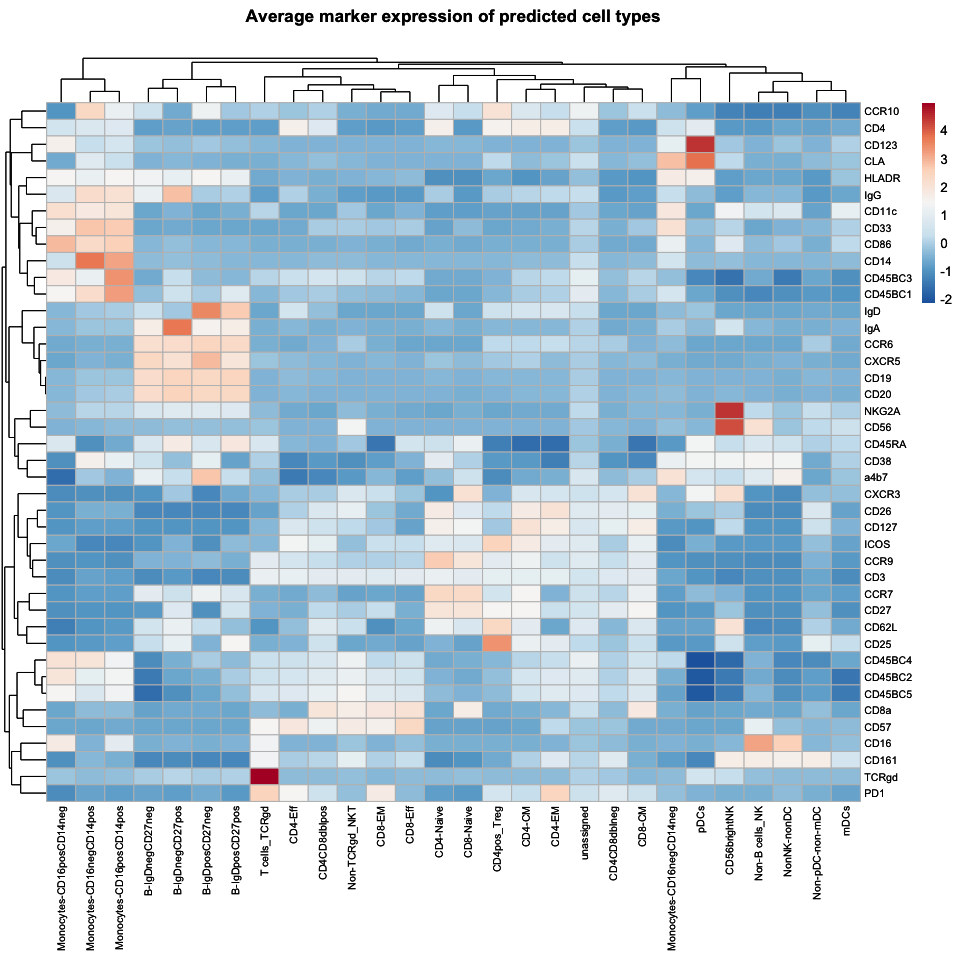

<!-- README.md is generated from README.Rmd. Please edit that file -->

# cyDefine

[](https://www.tidyverse.org/lifecycle/#experimental)

`cyDefine` robustly identifies canonical cell types as well as
unassigned (and potentially novel) cells in various single-cell
cytometry datasets.

## Article

The manuscript for `cyDefine` is in preparation.

Please cite with `citation("cyDefine")`.

## Install from GitHub

``` r
# To ensure Rstudio looks up BioConductor packages run:
setRepositories(ind = c(1:6, 8))
# Install cyCombine dependency
remotes::install_github("biosurf/cyCombine")

# Install cyDefine
remotes::install_github("claradrachmann/cyDefine", build_vignettes = TRUE)
```

## Documentation

To view the documentation for using `cyDefine`, start R and enter:

``` r
browseVignettes("cyDefine")
```

## Usage

Please see the vignettes for a detailed description of usage.

Here is a quick run-through of the main functionalities.

``` r
library(cyDefine)
mtry <- floor(sqrt(length(example_markers))) # Number of features to use for classification
# Run initial projection to exclude redundant cell types (Optional)
reference <- excl_redundant_populations(
      reference = example_reference,
      query = example_query,
      markers = example_markers,
      min_cells = 50,
      min_pct = 0.05,
      num.threads = 4,
      mtry = mtry,
      seed = 332
    )
#> Making initial projection to filter out redundant cell types of the reference
#> Excluding the following redundant celltypes from the reference: 
#> Basophil
```

``` r

# Run cyDefine
classified_query <- cyDefine(
  reference = reference, 
  query = example_query, 
  markers = example_markers, 
  num.threads = 4,
  mtry = mtry,
  num.trees = 500,
  adapt_reference = TRUE, 
  using_pbmc = FALSE, 
  batch_correct = TRUE, 
  xdim = 6, ydim = 6,
  norm_method = "scale",
  identify_unassigned = TRUE, 
  train_on_unassigned = FALSE,
  seed = 332,
  verbose = TRUE
  )
#> Warning in batch_correct(reference = reference, query = query, markers =
#> markers, : Overlapping sample ID(s) found between reference and query. Assuming
#> that these represent different samples. Adding '_ref' and '_query',
#> respectively, to the end of overlapping sample ID(s)
reference <- classified_query$reference
classified_query <- classified_query$query
```

## Visualizations

cyDefine provides functionality for visualizing your results by UMAP,
cell type abundance, and marker expression. Additionally, you can create
a chart of the merged cell populations during reference adaptation.

``` r
# Diagram of reference adaptation is only relevant if cell populations are merged (if "celltype_original" is created)
plot_diagram(reference, fontcolor_nodes = c("unassigned" = "white"))
#> No populations merged in the adaptation.
#> NULL
```

``` r

# Define a color per cell type + black for unassigned
celltype_colors <- get_distinct_colors(unique(reference$celltype), 
                                       add_unassigned = TRUE)

# UMAP of reference and query
plot_umap(reference,
          classified_query,
          example_markers,
          sample_n = 5000,
          colors = celltype_colors)
```



``` r
# Barplot of cell type abundances in query
plot_abundance(predicted_populations = classified_query$predicted_celltype,
               colors = celltype_colors)
```



``` r
# Heatmap of marker expressions per cell type in query
plot_heatmap(classified_query, 
             population_col = "predicted_celltype",
             markers_to_plot = example_markers)
```



## Report issues

If you have any issues or questions regarding the use of `cyDefine`,
please do not hesitate to raise an issue on GitHub. In this way, others
may also benefit from the answers and discussions.
