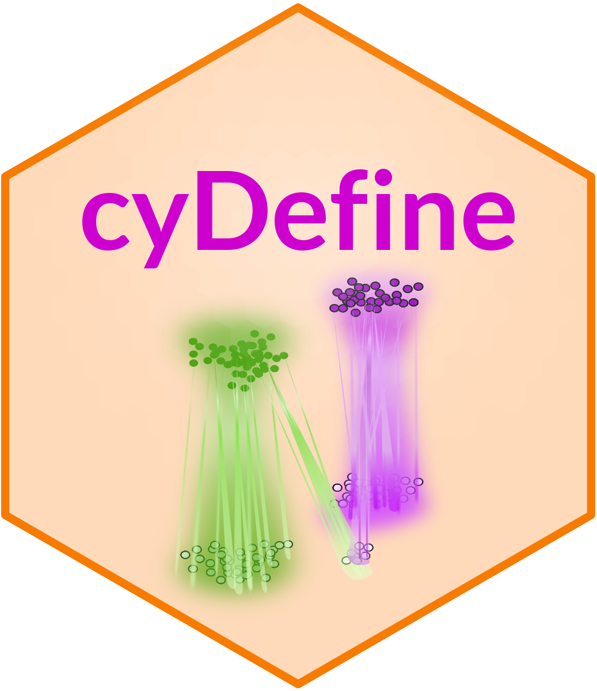
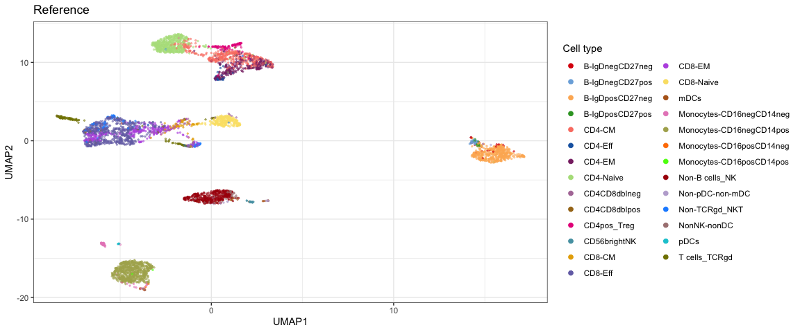
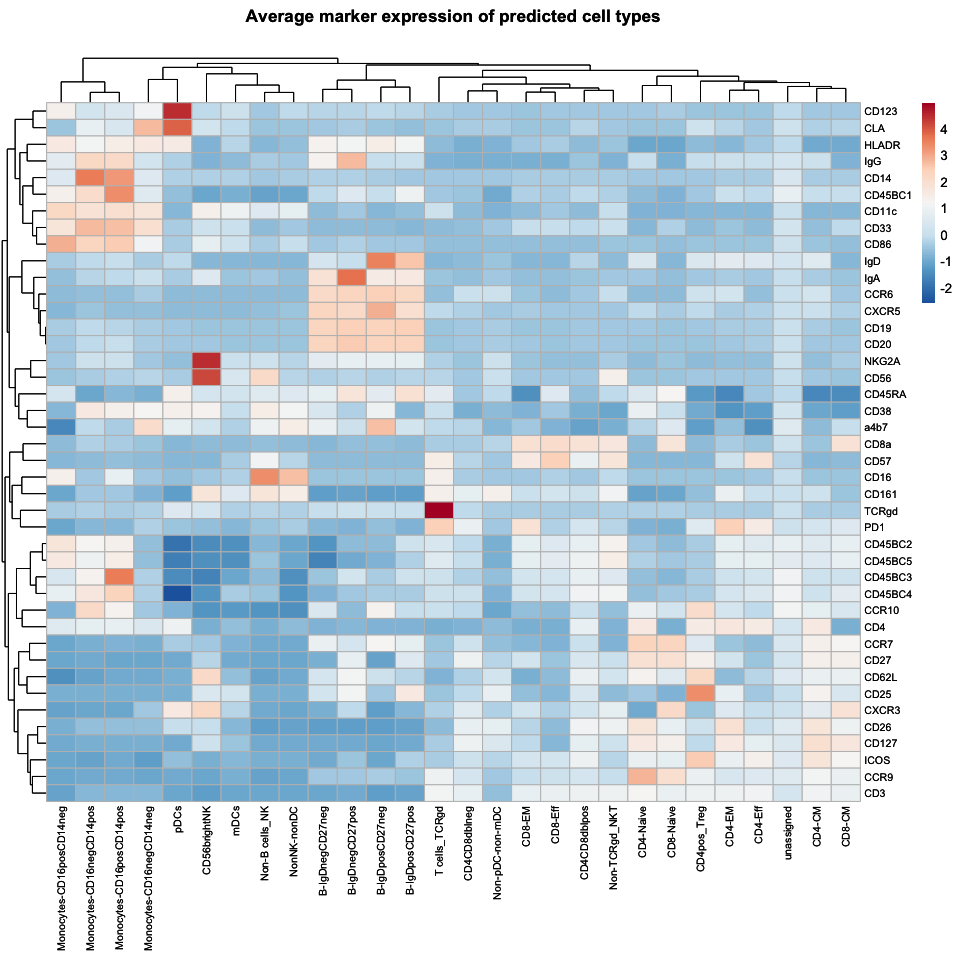

<!-- README.md is generated from README.Rmd. Please edit that file -->

# cyDefine 

[](https://www.tidyverse.org/lifecycle/#experimental)

`cyDefine` robustly identifies canonical cell types as well as
unassigned (and potentially novel) cells in various single-cell
cytometry datasets using reference-based phenotype transfer. In short,
`cyDefine` integrates a reference and query dataset, trains a random
forest model on the reference, and applies it to the query data.
Outliers and artifacts can then be identified based on unassigned cells
in the reference (supervised) or from dissimilarity to predicted cell
type (unsupervised).

## Article

The manuscript for `cyDefine` is in preparation.

Please cite with `citation("cyDefine")`.

## Install from GitHub

``` r
# To ensure Rstudio looks up BioConductor packages run:
setRepositories(ind = 1:2)
# If you are correcting cytometry data, install the following Bioconductor packages:
BiocManager::install(c("flowCore", "Biobase", "sva"))
# Install cyCombine dependency
remotes::install_github("biosurf/cyCombine")

# Install cyDefine
remotes::install_github("claradrachmann/cyDefine", build_vignettes = TRUE)
```

## Documentation

To view the documentation for using `cyDefine`, start R and enter:

``` r
browseVignettes("cyDefine")
```

## Usage

Please see the vignettes for a detailed description of usage.

Here is a quick run-through of the main functionalities using example
data.<br> A large PBMC reference is also available, see
`?pbmc_reference`.

``` r
library(cyDefine)

# Run the cyDefine pipeline
classified <- cyDefine(
  reference = example_reference, 
  query = example_query, 
  markers = example_markers,                   # markers/features to use
  num.threads = 4,                             # Number of threads for parallelization
  mtry = floor(length(example_markers)/3),     # Number of markers to use in random forest classification
  num.trees = 500,                             # Number of trees to build in classification
  adapt_reference = TRUE,                      # Whether the reference should be adapted to the markers available in the query
  using_pbmc = FALSE,                          # Whether the PBMC reference is used
  batch_correct = TRUE,                        # Whether to integrate the reference and query using cyCombine (see ?cyCombine::batch_correct for more options)
  xdim = 6, ydim = 6,                          # Clustering dimensions for the integration
  exclude_redundant = TRUE,                    # Exclude reference cells not in the query
  identify_unassigned = TRUE,                  # Whether unassignable cells should be identified
  train_on_unassigned = FALSE,                 # Whether unassigned cells should be identified unsupervised or using unassigned cells in the reference
  seed = 332,
  verbose = TRUE
  )
#> Adapting reference to query marker panel
#> # ------- Population merging - Round 1 ------- #
#> Running classification to identify similar populations
#> 
#> Reference adapted!
#> Warning in batch_correct(reference = reference, query = query, markers =
#> markers, : Overlapping sample ID(s) found between reference and query. Assuming
#> that these represent different samples. Adding '_ref' and '_query',
#> respectively, to the end of overlapping sample ID(s)
#> Batch correcting using a SOM grid of dimensions 6x6
#> Scaling expression data..
#> Creating SOM grid..
#> Batch correcting data..
#> Making initial projection to filter out redundant cell types of the reference
#> Excluding the following redundant celltypes from the reference: 
#> Basophil
#> Training random forest model using 4 threads
#> Model training took: 13.43 seconds
#> Identifying unassigned cells per predicted cell type
```

`cyDefine()` returns three objects:

``` r
names(classified)
#> [1] "query"     "reference" "model"
```

## Visualizations

cyDefine provides several functionalities for visualizing your results.
Here’s a highlight of a UMAP and a heatmap of marker expression. See the
[vignette](#documentation) for all plotting functions.

``` r

# Define a color per cell type + black for unassigned
celltype_colors <- get_distinct_colors(unique(classified$reference$celltype), 
                                       add_unassigned = TRUE)

# UMAP of reference and query
plot_umap(
  classified,
  example_markers,
  sample_n = 5000,
  colors = celltype_colors)
```

<!-- -->

``` r
# Heatmap of marker expressions per cell type in query
plot_heatmap(classified$query, 
             population_col = "predicted_celltype",
             markers_to_plot = example_markers)
```

<!-- -->

## Report issues

If you have any issues or questions regarding the use of `cyDefine`,
please do not hesitate to raise an issue on GitHub. In this way, others
may also benefit from the answers and discussions.
